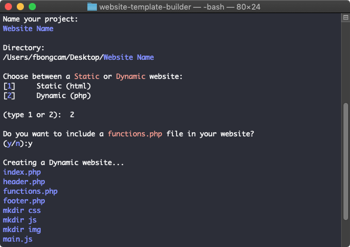

# Website Project Builder
Python script to build a static or dynamic website file structure.

When starting a new website project, this script will help you create the basic files and insert the base code required to start your project.



If you have problem with permissions when running the script
```
chmod u+x <path_to_file>/build_template.command
```
